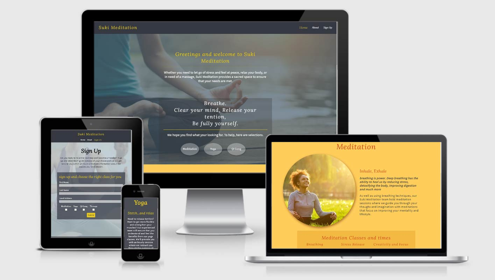

# Suki Meditation

The Suki Meditation website is built to service all walks of life to provide balance in peoples lives through the use of three different classes Meditation, Yoga and Qigong throughout the week, plus therapy sessions in Birmingham, England.

[View the live Suki Meditation page here](https://jeromepg.github.io/suki-meditation)

## Features
The website consists of three pages, the Home, About and Sign up page. With the homepage, I have included multiple sections specific to each of the classes held at Suki Meditation. I have made it easier to to locate the different classes by adding buttons at the top of the home page that locate to the specific section of the page for example the Yoga button will take you to teh yoga section giving a brief explanation of the classes.